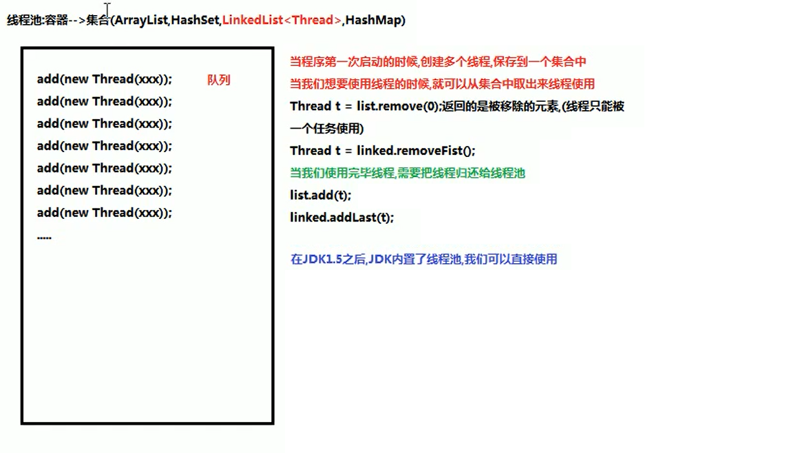

我们使用线程的时候就去创建一个线程，这样实现起来非常方便，但是就会产生一个问题：

如果并发线程有很多，并且每个线程都是执行一个时间很短的任务就结束了，这样频繁的创建线程就会大大降低系统的效率，因为频繁创建线程和销毁线程需要时间。

有没有一种办法使得线程可以重复使用，就是执行完一个任务，并不销毁这个线程，而是可以继续执行其他任务？

Java（JDK1.5之后）中可以使用线程池来达到这样的效果。

线程池其实就是一个容纳多个线程的容器，其中的线程可以反复使用，省区了频繁创建线程对象的操作，不需要反复创建线程消耗过多资源。

由于线程池中有很多操作都是与优化资源相关的，看图了解线程池的工作原理：

合理利用线程池能够带来三个好处：

1.降低资源消耗。减少了创建和销毁线程的次数,每个工作线程都可以被重复利用,可执行多个任务。

2.提高响应速度。当任务到达时,任务可以不需要的等到线程创建就能立即执行。

3.提高线程的可管理性。可以根据系统的承受能力,调整线程池中工作线线程的数目,防止因为消耗过多的內存,而把服务器累趴下(每个线程需要大约1MB内存,线程开
的越多,消耗的内存也就越大,最后死机）。

线程池:DK1.5之后提供的
java.util.concurrent.Executors:线程池的工厂类,用来生成线程池
Executors类中的静态方法:
static ExecutorService newFixedThreadPool(int nThreads)创建一个可重用固定线程数的线程池
参数:
    int nthreads:创建线程池中包含的线程数量
返回值:
    ExecutorService接口,返回的是 Executonservice接口的实现类对象,我们可以使用 ExecutorService接口接收(面向接口编程)

java.util.concurrent.ExecutorService:线程池接口

用来从线程池中获取线程,调用 start方法,执行线程任务 submit( Runnable task)提交一个 Runnable任务用于执行

关闭/销毁线程池的方法:void shutdown()

线程池的使用步骤:

1.使用线程池的工厂类 Executors里边提供的静态方法 newFixedThreadPool(int nThreads)生产一个指定线程数量的线程池

2.创建一个类实现 Runnable接口,重写rw方法,设置线程任务

3.调用 ExecutorService中的方法 submit,传递线程任务(实现类),开启线程,执行rWn方法

4.调用 ExecutorService中的方法 shutdown销毀线程池(不建议执行)