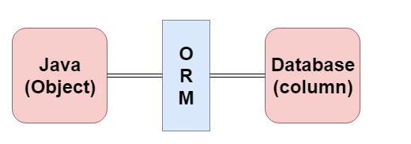

# JPA简介
JPA的全称是Java Persistence API， 即Java 持久化API，是SUN公司推出的一套基于ORM的规范，内部是由一系列的接口和抽象类构成。

JPA通过JDK 5.0注解描述对象－关系表的映射关系，并将运行期的实体对象持久化到数据库中。

它用于在Java对象和关系数据库之间保存数据。 JPA充当面向对象的领域模型和关系数据库系统之间的桥梁。

由于JPA只是一个规范，它本身不执行任何操作。 它需要一个实现。 因此，像 [Hibernate](http://www.yiibai.com/hibernate/)，TopLink 和 iBatis 这样的 ORM 工具实现了JPA 数据持久性规范。

> ORM
>
> 对象关系映射(ORM)是一种功能，用于通过将对象状态映射到数据库列来开发和维护对象和关系数据库之间的关系。 它能够轻松处理(或执行)各种数据库操作，如插入，更新，删除等。
>
> 
>

# JPA版本
作为EJB 3.0规范的一部分，Java持久API的第一个版本JPA 1.0于2006年发布。
以下是在JPA规范下发布的其他开发版本: -

- JPA 2.0 - 此版本于2009年下半年发布。以下是此版本的重要功能: 它支持验证。
 它扩展了对象关系映射的功能。它共享缓存支持的对象。

- JPA 2.1 - JPA 2.1于2013年发布，具有以下特性: 它允许提取对象。它为条件更新/删除提供支持。它生成模式。
- JPA 2.2 - JPA 2.2在2017年作为维护开发而发布。它的一些重要特性是: 它支持Java 8的日期和时间。它提供了@Repeatable注释，当想要将相同的注释应用到声明或类型用法时可以使用它。
它允许JPA注释在元注释中使用。它提供了流式查询结果的功能。

