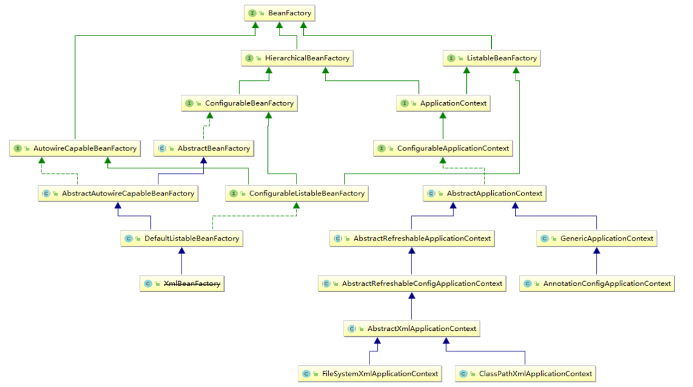

## 一、Spring的体系架构

### 体系架构总体概括

我们一般说 Spring 框架指的都是 Spring Framework，它是很多模块的集合，使用这些模块可以很方便地协助我们进行开发。这些模块是：**核心容器**、**数据访问/集成**、**Web**、**AOP（面向切面编程）**、**工具**、**消息**和**测试模块**。

比如：Core Container 中的 Core 组件是Spring 所有组件的核心，Beans 组件和 Context 组件是实现IOC和依赖注入的基础，AOP组件用来实现面向切面编程。

Spring的核心就是提供了一个容器（Container），通常又称为Spring应用上下文（Spring application context），用来创建和管理应用组件。这些组件即称为bean，会在应用上下文中装配在一起，从而形成一个完整的应用程序。砖、沙、木、管线——房子。

Spring 框架就是实现了 AOP 功能的DI容器，在DI容器的基础上加入AOP不仅仅做到松耦合开发，还因此具有了面向切面编程的功能。

Spring4版本中主要的模块，如下图：


Spring 有可能成为所有企业应用程序的一站式服务点，因为 Spring 的设计一直推崇模块化，所以Spring中的每一个模块都可以单独使用，或者与其它一个或者多个模块联合使用。

在我们使用Spring框架来构建应用时，允许挑选适用于的模块，不必把没有用到的模块也引入。框架为我们提供约 20 个模块，可以根据应用程序的要求来使用。

------

> 常用 Spring 模块的介绍：
>
> 1. **Test 模块**：
>
>    Spring框架提供了测试的模块，可以实现单元测试，集成测试等等的测试流程，整合了JUnit或者TestNG测试框架。
>
>    ```
>    org.springframework:spring-test
>    ```
>
> 2. **Core Container核心容器模块**：
>
>    核心容器是Spring框架的重要组成部分，也可以说是Spring框架的基础，其他所有的功能都需要依赖于该类库，主要提供 IoC 依赖注入功能（其在整个框架中的作用是负责进行 对象的创建，管理，配置等等的操作）。
>
>    ```
>    org.springframework:spring-beans
>    org.springframework:spring-core
>    org.springframework:spring-context
>    org.springframework:spring-expression
>    ```
>
> 3. **AOP和Aspects模块**：
>
>    Spring框架还提供了面向切面编程的能力，利用面向切面编程，可以实现一些面向对象编程无法很好实现的操作。例如，将日志，事务与具体的业务逻辑解耦。
>
>    ```
>    org.springframework:spring-aop
>    org.springframework:spring-aspects
>    ```
>
>    - spring-aspects：该模块为与AspectJ的集成提供支持。
>    - spring-aop ：提供了面向切面的编程实现。
>
> 4. **Messaging模块**：
>
>    提供系统内各个节点的交互。
>
> 5. **Instrumentation模块**：
>
>    该模块提供了为 JVM 添加代理的功能，该模块包含Spring-Instrument，Spring-Instrument-Tomcat组件，使用较少不必过分关注。
>
> 6. **Data Access/Integration数据访问与集成模块**：
>
>    Spring框架为了简化数据访问的操作，包装了很多关于数据访问的操作，提供了相应的模板。
>
>    同时还提供了使用ORM框架的能力，可以与很多流行的ORM框架进行整合，如Hibernate，Mybatis等等的著名框架。
>
>    还实现了数据事务的能力，能够支持事务。
>
>    ```
>    org.springframework:spring-jdbc
>    org.springframework:spring-tx
>    org.springframework:spring-orm
>    org.springframework:spring-oxm
>    org.springframework:spring-jms
>    org.springframework:spring-messaging
>    ```
>
>    - spring-jdbc : Java数据库连接。
>    - spring-jms ：Java消息服务。
>    - spring-orm : 用于支持Hibernate等ORM工具。
>
> 7. **Web和远程调用模块**：
>
>    Spring框架支持Web开发，以及与其他应用远程交互调用的方案。
>
>    ```
>    org.springframework:spring-web
>    org.springframework:spring-websocket
>    org.springframework:spring-servlet		??
>    org.springframework:spring-portlet
>    ```
>
>    

------


### 1、Core Container 核心容器

https://www.jianshu.com/p/2854d8984dfc

核心容器由  **`spring-core`，`spring-beans`，`spring-context`，`spring-context-support`和`spring-expression（SpEL，Spring表达式语言Spring Expression Language）`** 等模块组成:

- spring-core和spring-beans模块提供了框架的基本部分，包括IoC（控制反转）和DI（依赖项注入）特性；
- spring-context 模块模构建于Core和Beans模块基础之上，提供了一种类似 JNDI注册器的框架式的对象访问方法，继承了Beans的特性，为 Spring 核心提供了大量扩展，添加了对国际化（例如资源绑定）、事件传播、资源加载和对Context的透明创建的支持。spring-context模块同时也支持J2EE的一些特性，ApplicationContext接口是Context模块的关键；
- spring-expression 模块提供了强大的表达式语言，用于在运行时查询和操纵对象。

Spring容器可以理解为生产对象（object）的地方，在这里容器并不只是帮我们创建了对象那么简单，它负责了对象的整个生命周期--创建、装配、销毁。

对象的创建管理的控制权都交给了Spring容器，这是一种控制权的反转，所以又称为IoC容器。IoC容器不只是Spring才有，很多框架也都有该技术。

BeanFactory 和 ApplicationContext 是 Spring 的两大核心接口，而其中 ApplicationContext 是 BeanFactory 的子接口。它们都可以当做 Spring 的容器，Spring 容器是生成Bean实例的工厂，并管理容器中的Bean。

在基于 Spring 的 Java EE 应用中，所有的组件都被当成 Bean 处理，包括数据源，Hibernate 的 SessionFactory、事务管理器等。

生活中我们一般会把生产产品的地方称为工厂，而在这里bean对象的地方官方取名为 BeanFactory，直译 Bean工厂（com.springframework.beans.factory.BeanFactory），我们一般称 BeanFactory 为 IoC 容器，而称 ApplicationContext 为应用上下文，二者区别如下：

- BeanFactory 一般不常用，这是最简单的容器，只能提供基本的DI功能；
- 继承了 BeanFactory 后派生而来的 ApplicationContext(应用上下文)，它能提供更多企业级的服务，例如解析配置文本信息等等，这也是ApplicationContext 实例对象最常见的应用场景。




------

> 它们的细节如下： 
>
> - **spring-core 模块**：提供了框架的基本组成部分，包括 `IoC`  和 `依赖注入`功能。
>
> - **spring-beans 模块**：
>
>   提供 `BeanFactory`，**<u>工厂模式</u>**的微妙实现，它移除了编程式单例的需要，并且可以把<u>配置</u>和<u>依赖</u>从实际编码逻辑中解耦。
>
> - **spring-context 模块**：
>
>   建立在前两者的基础上，以一种类似于**JNDI**注册的方式访问对象。模块继承自Bean模块，并且添加了国际化（比如，使用资源束）、事件传播、资源加载和透明地创建上下文（比如，通过Servelet容器）等功能。也支持了 Java EE的功能，比如EJB、JMX和远程调用等。**ApplicationContext** 接口是该模块的焦点。
>
>   **spring-context-support** 提供了对第三方库集成到Spring上下文的支持，比如缓存（EhCache，Guava，JCache）、邮件（JavaMail）、调度（CommonJ，Quartz）、模板引擎（FreeMarker，JasperReports，Velocity）等。
>
> - **spring-expression**模块：
>
>   提供了强大的表达式语言，用于在运行时查询和操作对象图。它是JSP2.1规范中定义的统一表达式语言的扩展，支持set和get属性值、属性赋值、方法调用、访问数组集合及索引的内容、逻辑算术运算、命名变量、通过名字从Spring IoC容器检索对象，还支持列表的投影、选择以及聚合等。

------

它们的完整依赖关系如下图所示：


### 2、DataAccess/Integration

数据访问/集成层包括 JDBC，ORM，OXM，JMS 和事务处理模块:

------

> 它们的细节如下： 
>
> - **JDBC(Java DataBase Connectivity)** 模块：
>
>   提供了JDBC抽象层，它消除了冗长的JDBC编码和对数据库供应商特定错误代码的解析。
>
> - **ORM(Object Relational Mapping)** 模块：
>
>   提供了对流行的对象关系映射API的集成，包括JPA、JDO和Hibernate等。通过此模块可以让这些ORM框架和spring的其它功能整合，比如前面提及的事务管理。
>
> - **OXM(Object XML Mapping)** 模块：
>
>   提供了对OXM实现的支持，比如JAXB、Castor、XML Beans、JiBX、XStream等。
>
> - **JMS(Java Message Service)** 模块：
>
>   包含生产（produce）和消费（consume）消息的功能。
>
>   从Spring 4.1开始，集成了spring-messaging模块。
>
> - **事务(Transaction)模块**：
>
>   为实现特殊接口类及所有的 POJO 支持编程式和声明式事务管理。（注：编程式事务需要自己写beginTransaction()、commit()、rollback()等事务管理方法，声明式事务是通过注解或配置由spring自动处理，编程式事务粒度更细）

------


### 3、Web

Web 层由 Web，Web-MVC，Web-Socket 和 Web-Portlet 组成，它们的细节如下：

------

> - **Web** 模块
>
>   提供面向web的基本功能和面向web的应用上下文，比如多部分（multipart）文件上传功能、使用Servlet监听器初始化IoC容器等。它还包括HTTP客户端以及Spring远程调用中与web相关的部分。。
>
> - **Web-MVC** 模块
>
>   为web应用提供了模型视图控制（MVC）和REST Web服务的实现。Spring的MVC框架可以使领域模型代码和web表单完全地分离，且可以与Spring框架的其它所有功能进行集成。
>
> - **Web-Socket** 模块
>
>   为 WebSocket-based 提供了支持，而且在 web 应用程序中提供了客户端和服务器端之间通信的两种方式。
>
> - **Web-Portlet** 模块
>
>   提供了用于Portlet环境的MVC实现，并反映了spring-webmvc模块的功能。

------


### 4、AOP、Aspect ...

还有其他一些重要的模块，像 [AOP](https://www.w3cschool.cn/wkspring/izae1h9w.html)，Aspects，Instrumentation，Web 和测试模块，它们的细节如下：

------

> - **AOP** 模块
>
>   提供了面向方面的编程实现，允许你定义方法拦截器和切入点对代码进行干净地解耦，从而使实现功能的代码彻底的解耦出来。使用源码级的元数据，可以用类似于.Net属性的方式合并行为信息到代码中。
>
> - **Aspects** 模块
>
>   提供了与 **AspectJ** 的集成，这是一个功能强大且成熟的面向切面编程（AOP）框架。
>
> - **Instrumentation** 模块
>
>   在一定的应用服务器中提供了类 instrumentation 的支持和类加载器的实现。
>
> - **Messaging** 模块
>
>   为 STOMP 提供了支持作为在应用程序中 WebSocket 子协议的使用。
>
>   它也支持一个注解编程模型，它是为了选路和处理来自 WebSocket 客户端的 STOMP 信息。
>
> - **测试**模块
>
>   支持对具有 JUnit 或 TestNG 框架的 Spring 组件的测试。

------

